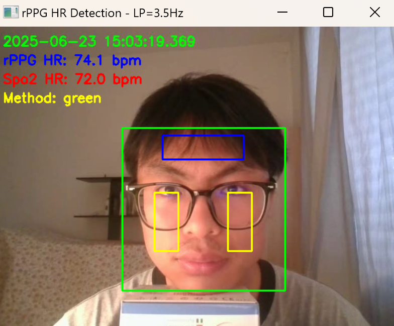

# Biometric Sensing & Spectral Analysis (RPPG)

<table width="100%">
  <tr>
    <td width="75%" style="border: none; vertical-align: top;">
      <h2>1. Institutional Background</h2>
      This project was developed at <b>Politecnico di Milano (Polimi)</b> within the <b><a href="https://www.deib.polimi.it/eng/research-labs">DEIB (Dipartimento di Elettronica, Information and Bioengineering)</a></b>.
        
      Research conducted at:
      <ul>
        <li><b><a href="https://nearlab.polimi.it/">NearLab - Neuroengineering and Medical Robotics</a></b></li>
        <li><b><a href="https://github.com/n-health-lab-polimi">n-health-lab</a></b></li>
      </ul>
      This implementation is an extension of the framework provided by the <b>n-health-lab-2025</b> project:  
      <a href="https://github.com/n-health-lab-polimi/n-health-lab-2025.git">[Reference Repository]</a>
    </td>
    <td width="25%" align="right" style="border: none; vertical-align: top;">
      
    </td>
  </tr>
</table>

## 2. Project Overview
This repository implements a **Remote Photoplethysmography (RPPG)** pipeline designed for non-contact heart rate monitoring. It leverages computer vision to detect facial ROI and digital signal processing (DSP) to extract vital signs from skin color variations.

  
   
  <i>Figure 1: Demonstration of the RPPG pipeline in real-time operation.</i>

## 3. Technical Implementation
* **ROI Detection**: Utilized **Res10-SSD** for robust face tracking within the NearLab research framework.
* **Signal Extraction**: Captured Blood Volume Pulse (BVP) signals from facial Region of Interest (ROI).
* **Spectral Analysis**: Applied **FFT (Fast Fourier Transform)** to identify dominant pulse frequencies.
* **Filtering**: Implemented band-pass filters to eliminate illumination noise and motion artifacts.
* **Validation**: Verified against **CMS50D** medical-grade pulse oximeters.

## 4. Tech Stack
* **Institution**: Politecnico di Milano (Polimi)
* **Department**: DEIB (Electronics, Information and Bioengineering)
* **Frameworks**: PyTorch, OpenCV, NumPy, SciPy

## 5. License
This project is for academic purposes as part of the MS in Telecommunications Engineering at Polimi.